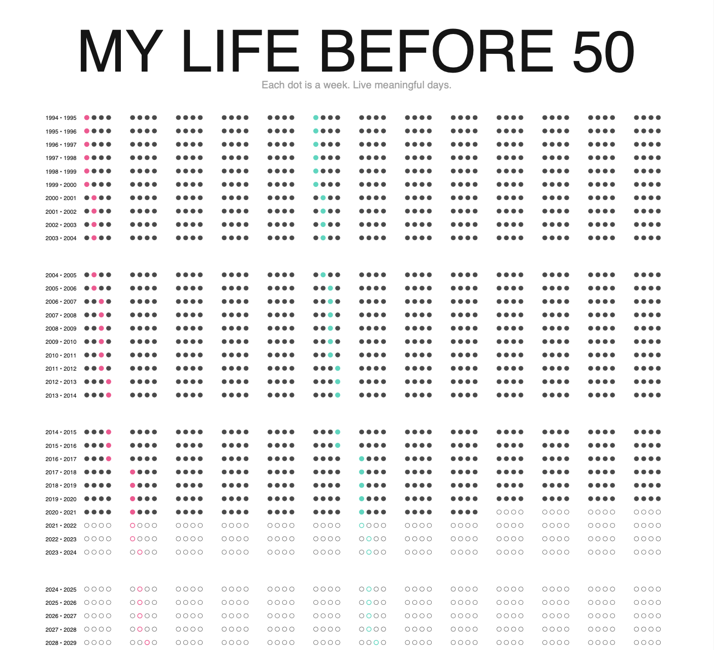

# Life Calendar Generator

## Requirements

```
pip3 install svglib
pip3 install svgwrite
```

## Usage
- Tweak `config.py` file to change to your birthday, amount of years and more.
- Type `make` or run `life-calendar.py`
- Check the `output` folder


